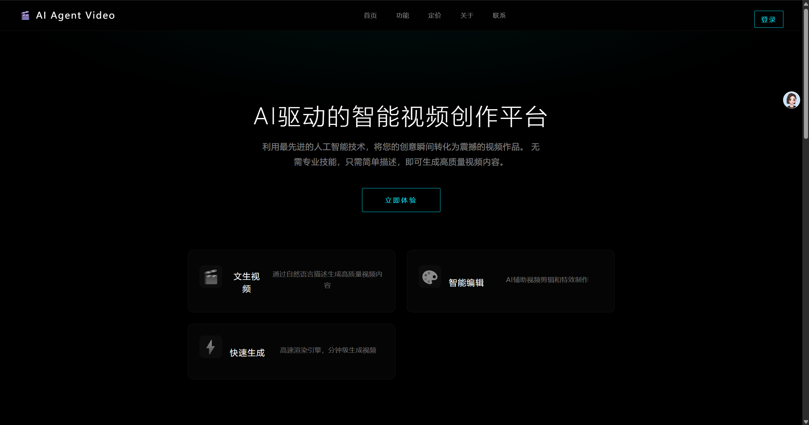
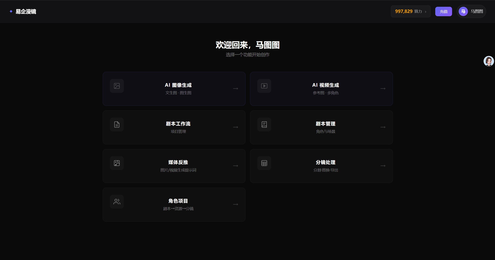
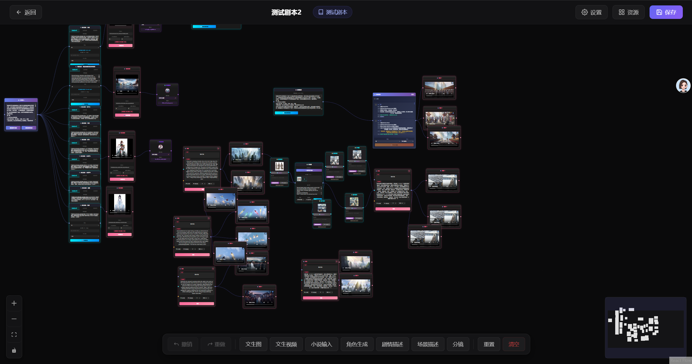
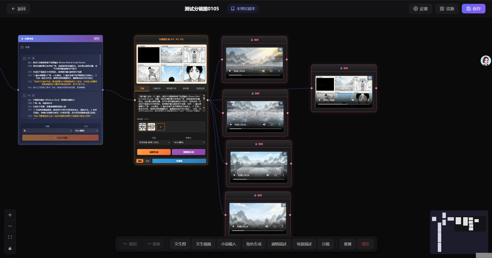

# SoulArtisan

AI 驱动的创意内容生成平台，支持 AI 图像生成、视频生成、角色项目管理、可视化工作流编辑等功能。

目前需要搭配 [棱镜接口中转平台](https://github.com/EaseeSoft/Prism) 使用，或者可以自行修改接口对接方式。

## 功能特性

### AI 内容生成
- **AI 对话** - 集成 Gemini / OpenAI 兼容 API，支持多模态对话
- **AI 图像生成** - 文生图、图生图，支持多种模型和画面比例
- **AI 视频生成** - Sora 等模型驱动的视频生成，支持异步任务和回调
- **AI 角色生成** - 自动化角色形象生成

### 角色项目管理
- **剧本管理** - 剧本创建、编辑、AI 辅助分析
- **分镜系统** - AI 提取分镜、批量生成分镜图片
- **角色资源库** - 角色和场景资源统一管理
- **分镜视频** - 分镜到视频的全流程工作流

### 可视化工作流
- **节点编辑器** - 基于 ReactFlow 的拖拽式工作流设计
- **丰富节点类型** - 故事描述、角色分析、分镜生成、图像生成、视频生成等
- **项目管理** - 工作流项目的创建、保存和复用

### 多租户管理系统
- **站点管理** - 支持多站点独立运行，每个站点独立配置
- **用户管理** - 用户注册、登录、权限控制
- **点数系统** - AI 调用的算力消费管理，支持卡密充值
- **日志审计** - 操作日志和登录日志记录

### 其他功能
- **云存储** - 腾讯云 COS 集成，支持文件上传和预签名 URL
- **并发控制** - AI 任务的并发数限制
- **提示词管理** - 系统级提示词模板配置

## 示例图




## 技术栈

### 后端

| 技术 | 版本 | 说明 |
|------|------|------|
| Spring Boot | 3.3.5 | 应用框架 |
| Spring AI | 1.1.2 | AI 模型集成 |
| MyBatis Plus | 3.5.5 | ORM 框架 |
| MySQL | 8.0+ | 关系型数据库 |
| Redis | 6.0+ | 缓存和分布式锁 |
| Sa-Token | 1.44.0 | 认证鉴权（JWT 模式）|
| Flyway | - | 数据库版本管理 |
| Knife4j | 4.5.0 | API 文档 |
| 腾讯云 COS SDK | 5.6.97 | 对象存储 |
| Hutool | 5.8.39 | 工具库 |

### 前端 - 用户端（agent-web）

| 技术 | 版本 | 说明 |
|------|------|------|
| React | 19 | UI 框架 |
| TypeScript | 5.x | 类型安全 |
| ReactFlow | 11.11.4 | 可视化工作流 |
| React Router | 7.x | 路由管理 |
| Zustand | - | 状态管理 |
| Axios | - | HTTP 客户端 |
| Vite | 7.x | 构建工具 |

### 前端 - 管理后台（admin-web）

| 技术 | 版本 | 说明 |
|------|------|------|
| React | 19 | UI 框架 |
| TypeScript | 5.x | 类型安全 |
| Ant Design | 5.22.6 | UI 组件库 |
| Recharts | 3.6.0 | 数据可视化 |
| Zustand | - | 状态管理 |
| Vite | 6.x | 构建工具 |

## 项目结构

```
SoulArtisan/
├── playlet/                          # 后端服务（Spring Boot）
│   ├── src/main/java/com/jf/playlet/
│   │   ├── admin/                    # 管理后台模块
│   │   │   ├── controller/           # 管理 API 接口
│   │   │   ├── service/              # 管理业务逻辑
│   │   │   ├── entity/               # 管理数据实体
│   │   │   ├── mapper/               # MyBatis Mapper
│   │   │   ├── dto/                  # 请求和响应 DTO
│   │   │   └── annotation/           # 自定义注解
│   │   ├── controller/               # 用户端 API 接口
│   │   ├── service/                  # 核心业务逻辑
│   │   │   └── ai/                   # AI 服务（Agent、工具链）
│   │   ├── entity/                   # 数据实体
│   │   ├── mapper/                   # MyBatis Mapper
│   │   ├── dto/                      # DTO
│   │   └── common/                   # 公共模块（配置、工具、异常处理）
│   └── src/main/resources/
│       ├── application.yml           # 主配置
│       ├── application-dev.yml       # 开发环境
│       ├── application-prod.yml      # 生产环境
│       ├── db/migration/             # Flyway 数据库迁移脚本
│       └── mapper/                   # MyBatis XML 映射
├── agent-web/                        # 用户端前端（React）
│   ├── src/
│   │   ├── api/                      # API 接口层
│   │   ├── components/
│   │   │   ├── auth/                 # 登录注册
│   │   │   ├── dashboard/            # 工作台
│   │   │   │   ├── nodes/            # 工作流节点组件
│   │   │   │   └── workflows/        # 工作流核心
│   │   │   ├── generators/           # 图像/视频生成器
│   │   │   ├── home/                 # 首页
│   │   │   ├── layout/               # 布局组件
│   │   │   └── pages/                # 页面组件
│   │   └── constants/                # 常量和枚举
│   └── vite.config.ts
└── admin-web/                        # 管理后台前端（React + Ant Design）
    ├── api/                          # API 接口层
    ├── components/                   # 公共组件
    ├── pages/                        # 页面
    │   ├── CardKey/                  # 卡密管理
    │   ├── MySite/                   # 站点配置
    │   ├── Points/                   # 点数管理
    │   ├── Site/                     # 站点管理
    │   └── User/                     # 用户管理
    ├── store/                        # 状态管理
    └── types.ts                      # 类型定义
```

## 环境要求

- JDK 17+
- Node.js 18+
- MySQL 8.0+
- Redis 6.0+
- Maven 3.8+
- pnpm 8+

## 快速开始

### 1. 克隆项目

```bash
git clone https://github.com/your-username/SoulArtisan.git
cd SoulArtisan
```

### 2. 后端配置

```bash
cd playlet

# 复制环境变量示例文件
cp .env.example .env

# 编辑 .env 文件，填入你的配置
# DB_HOST, DB_PORT, DB_NAME, DB_USERNAME, DB_PASSWORD
# REDIS_PASSWORD
# JWT_SECRET_KEY
# OPENAI_API_KEY, OPENAI_BASE_URL
```

### 3. 初始化数据库

```bash
# 创建数据库
mysql -u root -p -e "CREATE DATABASE agent_video CHARACTER SET utf8mb4 COLLATE utf8mb4_0900_ai_ci;"

# 导入基础表结构
mysql -u root -p agent_video < src/main/resources/sql/agent_video.sql

# Flyway 会在应用启动时自动执行增量迁移
```

### 4. 启动后端

```bash
cd playlet
mvn spring-boot:run -Dspring-boot.run.profiles=dev
```

启动后访问 API 文档：http://localhost:8080/api/doc.html

### 5. 启动用户端前端

```bash
cd agent-web
pnpm install
pnpm dev
```

访问地址：http://localhost:5173

### 6. 启动管理后台前端

```bash
cd admin-web
pnpm install
pnpm dev
```

访问地址：http://localhost:5174

## 环境变量说明

| 变量名 | 说明 | 示例 |
|--------|------|------|
| `DB_HOST` | 数据库地址 | `127.0.0.1` |
| `DB_PORT` | 数据库端口 | `3306` |
| `DB_NAME` | 数据库名称 | `agent_video` |
| `DB_USERNAME` | 数据库用户名 | `root` |
| `DB_PASSWORD` | 数据库密码 | - |
| `REDIS_PASSWORD` | Redis 密码 | - |
| `JWT_SECRET_KEY` | JWT 签名密钥（至少 32 字符）| - |
| `OPENAI_API_KEY` | OpenAI 兼容 API Key | - |
| `OPENAI_BASE_URL` | OpenAI 兼容 API 地址 | `https://api.openai.com` |
| `ADMIN_CONFIG_ENCRYPT_KEY` | AES 加密密钥（16 字符）| - |
| `ADMIN_CONFIG_ENCRYPT_IV` | AES 加密 IV（16 字符）| - |

## API 文档

后端启动后，通过 Knife4j 提供交互式 API 文档：

- 开发环境：http://localhost:8080/api/doc.html

主要 API 模块：

| 模块 | 路径前缀 | 说明 |
|------|----------|------|
| 用户认证 | `/api/auth` | 登录、注册 |
| AI 对话 | `/api/chat` | Gemini / OpenAI 对话 |
| 图像生成 | `/api/image` | 文生图、图生图 |
| 视频生成 | `/api/video` | AI 视频生成 |
| 角色项目 | `/api/character-project` | 角色项目 CRUD |
| 工作流项目 | `/api/workflow-project` | 工作流管理 |
| 管理后台 | `/api/admin/*` | 站点、用户、卡密、点数管理 |

## 架构说明

```
                    ┌─────────────┐     ┌─────────────┐
                    │  agent-web  │     │  admin-web  │
                    │  用户端前端  │     │  管理后台    │
                    └──────┬──────┘     └──────┬──────┘
                           │                    │
                           └────────┬───────────┘
                                    │ HTTP API
                           ┌────────┴────────┐
                           │     playlet     │
                           │  Spring Boot    │
                           │    后端服务      │
                           └───┬────┬────┬───┘
                               │    │    │
                    ┌──────────┤    │    ├──────────┐
                    │          │    │    │          │
               ┌────┴───┐ ┌───┴──┐ │ ┌──┴───┐ ┌───┴────┐
               │ MySQL  │ │Redis │ │ │ COS  │ │  AI    │
               │ 数据库  │ │ 缓存 │ │ │ 存储 │ │ 模型   │
               └────────┘ └──────┘ │ └──────┘ └────────┘
                                   │
                          ┌────────┴────────┐
                          │   Flyway 迁移    │
                          │   数据库版本管理   │
                          └─────────────────┘
```

### 认证体系

- 用户端和管理端使用独立的认证体系（Sa-Token 多账号体系）
- JWT 无状态令牌，30 天有效期
- 管理员区分系统管理员和站点管理员

### 多租户设计

- 每个站点独立配置 AI API Key、COS 存储等
- 站点配置支持加密存储（AES）
- 请求通过 Site Header 识别租户

## 开发指南

### 数据库迁移

项目使用 Flyway 管理数据库版本。新增迁移脚本：

```
playlet/src/main/resources/db/migration/V{日期}__{描述}.sql
```

命名规范：`V20250101__add_new_table.sql`

### 新增 API 接口

1. 在 `dto/` 中定义请求和响应对象
2. 在 `mapper/` 中定义 MyBatis Mapper
3. 在 `service/` 中实现业务逻辑
4. 在 `controller/` 中定义 REST 接口
5. 统一使用 `Result<T>` 包装返回值

### 新增工作流节点

1. 在 `agent-web/src/components/dashboard/nodes/` 中创建节点组件
2. 在 `nodeRegistry.ts` 中注册节点类型
3. 在工作流配置中添加节点定义

## 部署

### Docker 部署（推荐）

```bash
# 构建后端镜像
cd playlet
mvn clean package -DskipTests
docker build -t soulartisan-api .

# 构建前端镜像
cd agent-web
pnpm build
# 使用 nginx 托管 dist 目录

cd admin-web
pnpm build
# 使用 nginx 托管 dist 目录
```

### 传统部署

```bash
# 后端打包
cd playlet
mvn clean package -DskipTests
java -jar target/playlet-*.jar --spring.profiles.active=prod

# 前端打包
cd agent-web && pnpm build
cd admin-web && pnpm build
# 将 dist 目录部署到 Nginx
```

### Nginx 配置示例

```nginx
server {
    listen 80;
    server_name your-domain.com;

    # 用户端前端
    location / {
        root /path/to/agent-web/dist;
        try_files $uri $uri/ /index.html;
    }

    # 管理后台前端
    location /admin {
        alias /path/to/admin-web/dist;
        try_files $uri $uri/ /admin/index.html;
    }

    # API 代理
    location /api {
        proxy_pass http://127.0.0.1:8080;
        proxy_set_header Host $host;
        proxy_set_header X-Real-IP $remote_addr;
        proxy_set_header X-Forwarded-For $proxy_add_x_forwarded_for;
        proxy_read_timeout 300s;
    }
}
```

## 贡献指南

1. Fork 本仓库
2. 创建特性分支：`git checkout -b feature/your-feature`
3. 提交更改：`git commit -m 'feat: add some feature'`
4. 推送分支：`git push origin feature/your-feature`
5. 提交 Pull Request

### Commit 规范

- `feat:` 新功能
- `fix:` Bug 修复
- `refactor:` 重构
- `docs:` 文档更新
- `style:` 代码格式
- `test:` 测试相关
- `chore:` 构建/工具变动

## 开源协议

本项目采用 **学习开源、商业授权** 的许可模式。详见 [LICENSE](LICENSE) 文件。

### 使用条款

**学习和研究使用** ✅
- 个人学习、研究和非商业用途完全免费
- 可以自由使用、修改和分发源代码
- 必须保留原始版权声明

**商业使用** 🔒
- 任何商业用途（销售、提供服务、商业部署等）需要获得授权
- 请联系项目维护者协商商业许可证条款
